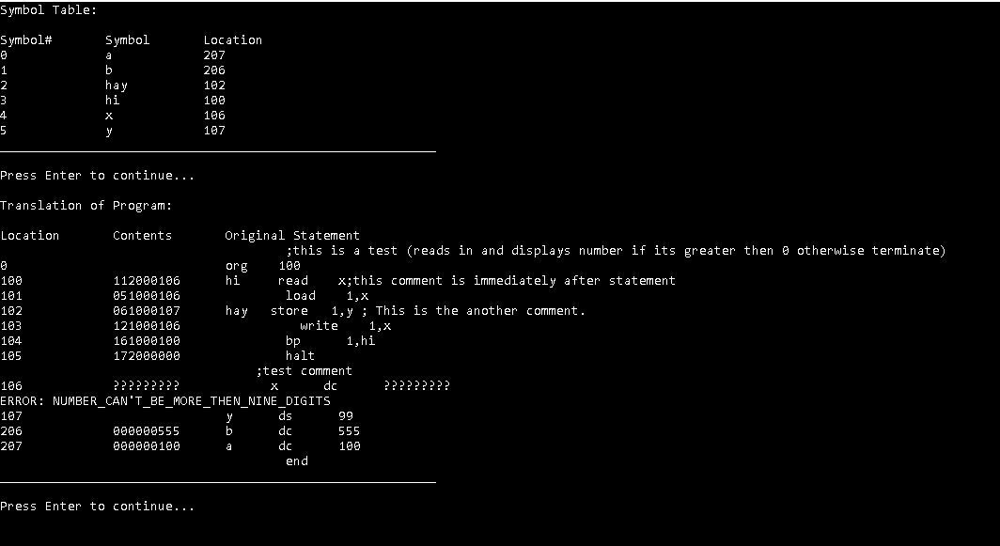
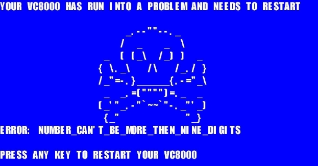

# The VC8000 PDC Collin Edition
The VC8000 PDC is a Personal Decimal Computer with 1,000,000 words of memory. Each word consists of 9 decimal digits. There is an additional 10 words of memory called registers. These are on chip memory.  The machine language instructions for the VC8000 is of the following form  Note: each has the same number of digits.

 

                |2 digits       | 1 digit         |6 digits       |
                |operation code | register number |address portion|  

### or

                |2 digits       | 1 digit         |1 digit        |  5 digits|
                |operation code | register number |register number| unused   |

 A machine language program is a sequence of machine language instructions stored in memory. The computer runs a machine language program by executing machine instructions stored in successive words of memory. The VC8000 machine assumes that the first instruction to be executed will be at location 100. The following are the machine language instructions for the VC8000.

### NAME           OP. CODE     MEANING

ADD                     01           Reg <-- c(Reg) + c(ADDR)   (The contents of the register specified in the instruction and of the memory location specified by the address portion of the instruction are added together. The result is placed in the register.):

SUBTRACT         02            Reg <-- c(Reg) - c(ADDR)

MULTIPLY           03            Reg <-- c(Reg) * c(ADDR)

DIVIDE                 04            Reg <-- c(Reg) / c(ADDR)

LOAD                   05            Reg <-- c(ADDR)

STORE                06            ADDR <-- c(Reg)

ADD REG            07            REG1 <--c(REG1) + c(REG2)   (Note: this is the second instruction format where two registers are specified.)

SUB REG            08            REG1 <--c(REG1) - c(REG2)  

MULT REG          09            REG1 <--c(REG1) * c(REG2)  

DIV REG              10            REG1 <--c(REG1) / c(REG2)  

READ                   11            A line is read in and the number found there is recorded in the specified memory address.  The register value is ignored.

WRITE                 12            c(ADDR) is displayed  The register value is ignored.

BRANCH              13           go to ADDR for next instruction.  The register value is ignored.

BRANCH MINUS  14          go to ADDR if c(Reg) < 0

BRANCH ZERO    15          go to ADDR if c(Reg) = 0

BRANCH POSITIVE 16       go to ADDR if c(Reg) > 0

HALT                    17           terminate execution.  The register value and address are ignored.

## A message from the author of this project

To whom it may concern
This is a term project that I did while I was a student (sophmore) at Ramapo College in the CMPS 361 SOFTWARE_DESIGN course
I will leave the notes on the implementation for reference for anyone looking at how it works. Not only is this 
a fully working implementation that does everything it is supposed to but in addition I added some additional touches
to this assembler like a HD COLOR ASCII graphic duck (my instructors favorite animal) playing Audio

### and Blue Screen Of Death when displaying errors.

I hope you enjoy this take on the VC 8000 PDC and with that have a good day 

## TEST CASES cut and paste into the Test.txt file

### TEST CASE #1

        ; file will read in 2 numbers and do a multi register operation on them
        org    100
    ; read in the 1st number
    collin      read    a
    ; register location(1 in our case) = a
      load 1,a
    ; save a in the specified register location(1)
      store 1,a
    ; read in the second number
       read b
    ; register location(6 in our case) = b
       load 6,b
    ; save b in the specified register location(6)
       store 6,b
    ; multiply the 2 registers together 
    ; you can change this operation code to "addr" for addition "subr" for subtraction
    ; "multr" for multiplication and "divr" for division (case insensitive)
       MULTR 1,6
    ; save the resultant in the specified register location
       store 1,a
    ; a = the resultant
       load 1,a
    ; display the final answer (a)
       write 1,a
    ; repeat until the solution is less then or equal to 0
       bp 1,collin

    ; terminate 
       halt
    x      dc      5
    y      DS      99
    b      dc      555
    a      dc      100000000
        end
		
### TEST CASE #2

	;this is a test (reads in and displays number if its greater then 0 otherwise terminate)
	    org    100
	hi     read    x;this comment is immediately after statement
	    load    1,x
hay   store   1,y ; This is the another comment.
	write    1,x
	bp      1,hi
	halt
	;test comment
x      dc      5
y      ds      99
b      dc      555
a      dc      100
    end

### TEST CASE #3

	; Read in a number and display its factorial
         org 100
                read 0, n
        more        load  1, n; This is a comment

    ;Here is a comment that sit on its own line.
                mult 1, fac
                store 1, fac
                load 1, n
                sub 1, one
                store 1, n
                bp 0,more
                write 0, fac
                halt
                n              ds 100; just to show that you code can handle big areas.
                fac           dc 1
                one          dc 1
                test          dc 1234 ; show your program can handle big constants.
                end

## To execute (you must have visual studio 2019 or newer) 
To execute click on Collin's VC8000.vcxproj and hit F5 and wait for the results
